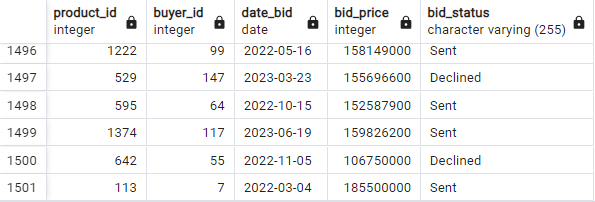

# Used Car Database
Berikut ini `used-car-db` yang telah saya buat. Database ini saya buat untuk memenuhi tugas project SQL dan lebih memahami prinsip-prinsip database design. Database ini dapat digunakan oleh penjual untuk menawarkan produknya (mobil bekas) dalam bentuk iklan dan calon pembeli dapat melakukan pencarian berdasarkan beberapa kategori. Saya juga sudah menuliskan mediumnya di sini:

[Desain Database Mobil Bekas](https://medium.com/@oscarmsinaga/desain-database-mobil-bekas-3d63eae89cd0)

## ERD database mobil bekas (`used-car-db`)


## Fitur dan Batasan
1. Setiap user aplikasi dapat menawarkan lebih dari satu produk mobil bekasnya.
2. Sebelum menjual produk mobil, user harus melengkapi data dirinya terlebih dahulu, seperti nama, kontak, dan domisili lokasi.
3. User menawarkan produknya melalui iklan yang akan ditampilkan oleh website.
4. Iklan ini berisikan judul, detail informasi produk yang ditawarkan, serta kontak penjual.
5. Beberapa informasi yang harus ditulis dalam iklan adalah sebagai berikut
    - merek mobil: Toyota, Daihatsu, Honda, dll
    - Model: Toyota Camry, Toyota Corolla Altis, Toyota Vios,Toyota Camry Hybrid, dll
    - Jenis body mobil: MPV, SUV, Van, Sedan, Hatchback, dll
    - Tipe mobil: manual atau automatic
    - Tahun pembuatan mobil: 2005, 2010, 2011, 2020 

    Deskripsi lain, seperti warna, jarak yang telah ditempuh, dsb,  boleh ditambahkan sesuai kebutuhan.
6. Setiap user bisa mencari mobil yg ditawarkan berdasarkan lokasi user penjual, merk mobil, dan jenis body mobil.
7. Jika calon pembeli tertarik terhadap sebuah mobil, ia dapat menawar (bid) harga produk jika penjual mengizinkan fitur tawar. 
8. Transaksi pembelian dilakukan di luar aplikasi sehingga tidak dalam scope project

## Mission Statement
- Menyediakan wadah untuk pedagang mengiklankan mobil bekasnya.
- Memudahkan customer untuk mencari dan menawar harga mobil bekas yang ingin dibeli sesuai dengan spesifikasi dan harga yang diinginkan.

## Dummy Dataset


## Syntax DDL
Berikut ini Syntax DDL untuk membangun database `used-car-db`
```sql
-- Create table city 
CREATE TABLE city
(
	city_id integer PRIMARY KEY,
	city_name varchar(255) UNIQUE NOT NULL,
	latitude float NOT NULL,
	longitude float NOT NULL
);

CREATE TABLE product_detail
(
	product_detail_id SERIAL PRIMARY KEY,
	brand varchar(255) ,
	model varchar(255) ,
	body_type varchar(255) ,
	transmission varchar(255) ,
	year integer,
	price integer
);

-- Create table seller 
CREATE TABLE seller
(
	seller_id SERIAL PRIMARY KEY,
	seller_name varchar(255) UNIQUE NOT NULL,
	seller_contact varchar(255) UNIQUE,
	city_id integer
);

-- Create table seller 
CREATE TABLE buyer
(
	buyer_id SERIAL PRIMARY KEY,
	buyer_name varchar(255) UNIQUE NOT NULL,
	buyer_contact varchar(255) UNIQUE,
	city_id integer
);

-- Create table product 
CREATE TABLE product
(
    product_id SERIAL PRIMARY KEY,
	product_detail_id integer,
	seller_id integer,
	title text ,
	date_post date
	
);

-- Create table bid 
CREATE TABLE bid
(
    bid_id SERIAL PRIMARY KEY,
	product_id integer,
	buyer_id integer ,
	date_bid date,
	bid_price integer ,
	bid_status varchar(255)
);

--Business Process

-- For table product_detail
-- The price must be > 0 
-- Column brand, model, body_type, and transmission must be not null

ALTER TABLE product_detail
	ADD CONSTRAINT price_check
		CHECK(
			price>0
		), 
	ALTER COLUMN brand SET NOT NULL,
	ALTER COLUMN model SET NOT NULL,
	ALTER COLUMN body_type SET NOT NULL,
	ALTER COLUMN transmission SET NOT NULL;

ALTER TABLE seller 
	ADD CONSTRAINT fk_city
		FOREIGN KEY (city_id)
		REFERENCES city(city_id),
	ALTER COLUMN city_id SET NOT NULL,
	ALTER COLUMN seller_contact SET NOT NULL;

ALTER TABLE buyer 
	ADD CONSTRAINT fk_city
		FOREIGN KEY (city_id)
		REFERENCES city(city_id),
	ALTER COLUMN buyer_contact SET NOT NULL;
	
-- For table product
-- product_detail_id and seller_id must be its foreign key and not null
 
ALTER TABLE product 
	ADD CONSTRAINT fk_product_detail
		FOREIGN KEY (product_detail_id) 
		REFERENCES product_detail(product_detail_id),
	ADD CONSTRAINT fk_seller
		FOREIGN KEY (seller_id) 
		REFERENCES seller(seller_id),
	ALTER COLUMN product_detail_id SET NOT NULL,
	ALTER COLUMN seller_id SET NOT NULL,
	ALTER COLUMN title SET NOT NULL,
	ALTER COLUMN date_post SET DEFAULT CURRENT_DATE;

-- For table product
-- Product_id must be its foreign key and not null 
-- Column bid_price must be > 0

ALTER TABLE bid 
	ADD	CONSTRAINT fk_product_id
		FOREIGN KEY (product_id)
		REFERENCES product(product_id),
	ADD	CONSTRAINT fk_buyer_id
		FOREIGN KEY (buyer_id)
		REFERENCES buyer(buyer_id),
	ADD CONSTRAINT bid_price_check
			CHECK(
				bid_price>0
		),
	ALTER COLUMN product_id SET NOT NULL,
	ALTER COLUMN buyer_id SET NOT NULL,
	ALTER COLUMN bid_status SET DEFAULT 'Sent',
	ALTER COLUMN date_bid SET DEFAULT CURRENT_DATE;
```


## Transactional Query
Berikut ini adalah sample query `SQL` pada `used-car-db`.

### 1. Mencari mobil keluaran 2015 ke atas
```sql
SELECT 
    * 
FROM 
    product_detail 
WHERE 
    year>=2015
;
```
`Output`:


### 2. Menambahkan satu data bid produk baru
```sql
INSERT INTO bid (bid_id,product_id, buyer_id, date_bid, bid_price, bid_status)
VALUES (1501,113, 7, '2022-03-04', 185500000, 'Sent');
```
`Output`:

**from : **


**to :**



### 3. Melihat semua mobil yg dijual 1 akun dari yg paling baru
--  Contoh: Mobil yang dijual oleh akun “Xanana Melan”
```sql
SELECT 
    seller_name, 
    product_detail_id, 
    brand, 
    model, 
    year, 
    price, 
    date_post
FROM 
    product
        INNER JOIN 
    product_detail USING (product_detail_id)
        INNER JOIN 
    seller USING(seller_id)
WHERE 
    seller_name='Xanana Melani';
```
`Output`:


### 4.Mencari mobil bekas yang termurah berdasarkan keyword
--  Contoh: Berdasarkan keyword “Yaris” (2% bobot)

```sql
SELECT 
    product_detail_id, 
    brand, 
    model, 
    year, 
    price
FROM 
    product_detail
WHERE 
    model LIKE '%Yaris%'
ORDER BY 
    price ASC;
```
`Output`:


### 5. Mencari mobil bekas yang terdekat berdasarkan sebuah id kota, jarak terdekat dihitung berdasarkan latitude longitude
--  Contoh: mencari mobil terdekat dengan id kota 3173 
```sql
WITH product_join AS
(
	SELECT 
        *
	FROM 
        product
	        INNER JOIN 
        product_detail USING (product_detail_id)
	        INNER JOIN 
        seller USING(seller_id)
	        INNER JOIN 
        city USING (city_id)
)
SELECT 
	car.product_id,
	car.product_detail_id,
	car.brand,
	car.model, 
	car.year, 
	car.price,
	SQRT(POWER(car.longitude - city.longitude,2) + POWER(car.latitude - city.latitude,2)) AS distance 
FROM 
    product_join AS car
        cross join 
    city
WHERE 
    city.city_id = 3173
ORDER BY 
    distance ASC;
```
`Output`:


##  Analytical Query

### 1. Ranking popularitas model mobil berdasarkan jumlah bid
--  Contoh: Bid untuk model mobil: Toyota Yaris.
```sql
WITH bid_count AS 
(
	SELECT 
        model, 
        count(bid_id) AS count_bid
	FROM 
        bid
	        INNER JOIN 
        product USING (product_id)
	        INNER JOIN 
        product_detail USING(product_detail_id)
	GROUP BY 
        model
),

product_count AS
(
	SELECT 
        model, 
        count(product_id) AS count_product
	FROM 
        product
	        INNER JOIN 
        product_detail USING(product_detail_id)
	GROUP BY 
        model
)

SELECT 
    *
FROM 
    product_count
        INNER JOIN 
    bid_count  USING (model)
ORDER BY 
    count_bid DESC	;
```
`Output`:


### 2. Membandingkan harga mobil berdasarkan harga rata-rata per kota
--  Contoh: Bid untuk model mobil: Toyota Yaris.
```sql
WITH product_join AS
(
	SELECT 
        *
	FROM
        product
	        INNER JOIN 
        product_detail USING (product_detail_id)
	        INNER JOIN 
        seller USING(seller_id)
	        INNER JOIN 
        city USING (city_id)
)

SELECT
	city_name,
	brand,
	model,
	year,
	price,
	AVG(price) OVER(PARTITION BY city_name) AS avg_car_city
FROM 
    product_join;
```
`Output`:


### 3. Dari penawaran suatu model mobil, cari perbandingan tanggal user melakukan bid dengan bid selanjutnya beserta harga tawar yang diberikan (4% bobot)
--  Contoh: Bid untuk model mobil: Toyota Yaris.
```sql
WITH join_bid AS 
(
	SELECT 
        *
	FROM 
        bid
	        INNER JOIN 
        product USING (product_id)
	        INNER JOIN 
        product_detail USING(product_detail_id)
)
SELECT
	model,
	buyer_id,
	date_bid AS first_bid_date,
	LEAD(date_bid) OVER (ORDER BY date_bid) AS next_bid_date,
	bid_price AS first_bid_price,
	LEAD(bid_price) OVER (ORDER BY date_bid) AS next_bid_price
FROM 
    join_bid
WHERE 
    model = 'Daihatsu Ayla'
ORDER BY 
    buyer_id;
```
`Output`:


### 4. Membandingkan persentase perbedaan rata-rata harga mobil berdasarkan modelnya dan rata-rata harga bid yang ditawarkan oleh customer pada 6 bulan terakhir (4% bobot)
- Difference adalah selisih antara rata-rata harga model mobil(avg_price) dengan rata-rata harga bid yang ditawarkan terhadap model tersebut(avg_bid_6month)
- Difference dapat bernilai negatif atau positif
- Difference_percent adalah persentase dari selisih yang telah dihitung, yaitu dengan cara difference dibagi rata-rata harga model mobil(avg_price) dikali 100%
- Difference_percent dapat bernilai negatif atau positif
- Contoh: Bid untuk model mobil: Toyota Yaris.
```sql
WITH avg_product_price AS
(
	SELECT 
        model, 
        avg(price) AS avg_price
	FROM 
        product_detail
	GROUP BY 
        model
)
,
product_bid AS 
(
	SELECT 
        *
	FROM 
        bid
	        INNER JOIN 
        product USING (product_id)
	        INNER JOIN 
        product_detail USING (product_detail_id)
)
,
avg_bid_price AS
(
	SELECT 
        model, 
        avg(bid_price) AS avg_bid_6month 
	FROM 
        product_bid 
	WHERE 
        date_bid >= (SELECT MAX(date_bid) - INTERVAL '6 MONTH' FROM bid)
	GROUP BY 
        model
)

SELECT 
	*,
	(avg_price - avg_bid_6month) AS difference,
	(avg_price - avg_bid_6month)/avg_price *100 AS difference_percent
    FROM 
        avg_product_price
            INNER JOIN 
        avg_bid_price USING (model);
```
`Output`:


### 5. Membuat window function rata-rata harga bid sebuah merk dan model mobil selama 6 bulan terakhir. (5% bobot)
--   Contoh: Mobil Toyota Yaris selama 6 bulan terakhir
```sql
CREATE FUNCTION CalculateWindowNMonthAvgBidPrice(n INTEGER) 
RETURNS TABLE (model VARCHAR, avg_bid_price DECIMAL) AS $$
BEGIN
    RETURN QUERY 
    WITH product_bid AS (
        SELECT *
        FROM 
            bid
                INNER JOIN 
            product USING (product_id)
                INNER JOIN 
            product_detail USING (product_detail_id)
    ),
    avg_bid_price_n_month AS (
        SELECT 
            pb.model, 
            AVG(pb.bid_price) AS avg_bid_price
        FROM 
            product_bid pb
        WHERE 
            pb.date_bid >= (SELECT MAX(date_bid) - INTERVAL '1 MONTH' * n FROM bid)
        GROUP BY 
            pb.model
    )
    SELECT * FROM avg_bid_price_n_month;
END;
$$ LANGUAGE plpgsql;

WITH avg_bid_price_6month AS
    (SELECT model, avg_bid_price AS m_min_6 FROM CalculateWindowNMonthAvgBidPrice(6)),
avg_bid_price_5month AS
    (SELECT model, avg_bid_price AS m_min_5 FROM CalculateWindowNMonthAvgBidPrice(5)),
avg_bid_price_4month AS 
    (SELECT model, avg_bid_price AS m_min_4 FROM CalculateWindowNMonthAvgBidPrice(4)),
avg_bid_price_3month AS
    (SELECT model, avg_bid_price AS m_min_3 FROM CalculateWindowNMonthAvgBidPrice(3)), 
avg_bid_price_2month AS 
    (SELECT model, avg_bid_price AS m_min_2 FROM CalculateWindowNMonthAvgBidPrice(2)),
avg_bid_price_1month AS
    (SELECT model, avg_bid_price AS m_min_1 FROM CalculateWindowNMonthAvgBidPrice(1)),

windows_function AS
(
	SELECT 
        * 
    FROM 
        avg_bid_price_6month
	        LEFT JOIN 
        avg_bid_price_5month USING (model)
	        LEFT JOIN 
        avg_bid_price_4month USING (model)
	        LEFT JOIN 
        avg_bid_price_3month USING (model)
	        LEFT JOIN 
        avg_bid_price_2month USING (model)
	        LEFT JOIN 
        avg_bid_price_1month USING (model)
)
,
distinct_product AS
(
	SELECT 
        distinct brand, 
        model 
    FROM product_detail
)

SELECT 
    brand, 
    windows_function.*
FROM 
    windows_function
INNER JOIN 
    distinct_product USING (model)
WHERE 
    model = 'Daihatsu Xenia';
```
`Output`:


## DBMS used
postgresql-16.1-1-windows-x64

## USAGE
* Step 1. Clone/Download this repository
* Step 2. [Install `Postgresql` on Windows/Linux/macOS](https://www.postgresql.org/download/) and **NOTE:** Your `root` password.
* Step 3. [Install `pgAdmin`](https://www.pgadmin.org/download/)
* Step 4. Create connection to your Postgresql, which could be locally or remote depending on where you installed the Postgresql.
* Step 5. Run `create-used-car-db.sql` from pgAdmin.

Now you are free to play with `SELECT` queries. 

## License
Unless otherwise specified, the database and its code on this repository is licensed under GPLv3 license. See the `LICENSE` file for more details.
